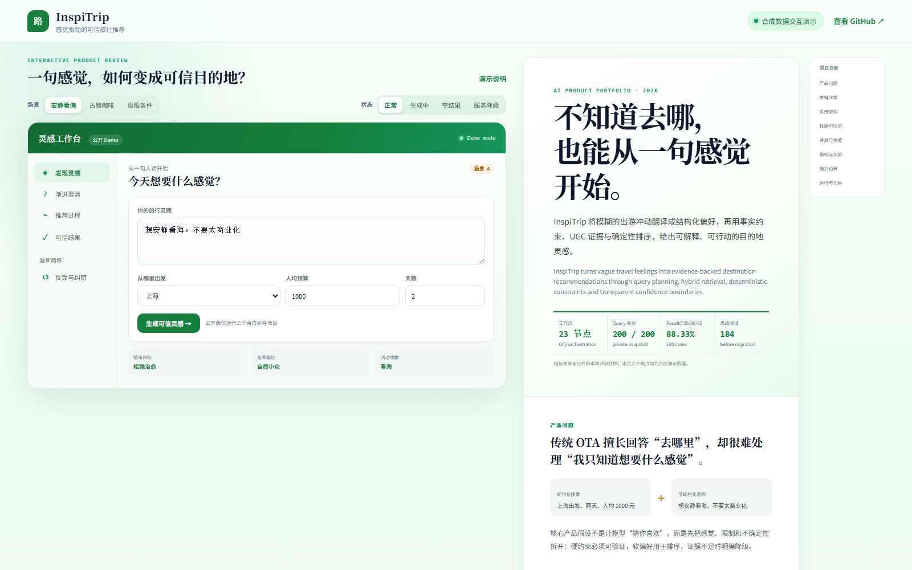

# InspiTrip · 感觉驱动的可信旅行推荐

[](https://hai-chao-ren.github.io/InspriTrip/)
[](#测试)
[](https://www.python.org/)
[](LICENSE)

> 用户不知道去哪，只知道“想安静看海、不要太商业化”。InspiTrip 将这句话拆成 Query Plan，通过混合检索发现候选，再用预算、天数和交通事实做硬过滤，以 UGC Claim 完成证据门控，最后输出可解释的目的地灵感。

**English summary:** InspiTrip turns vague travel feelings into evidence-backed destination recommendations through query planning, hybrid retrieval, deterministic constraints, claim-level evidence gates and transparent fallback behavior.

## 在线展示

- 综合评审页：<https://hai-chao-ren.github.io/InspriTrip/>
- 页面左侧可体验输入、渐进澄清、推荐过程、证据展开、反馈和异常状态。
- 页面右侧展示产品问题、关键决策、架构、数据模型、评测和能力边界。
- 在线页面只使用 6 个虚构目的地和合成证据，不调用任何后端或密钥。



## 为什么做这个项目

传统 OTA 擅长处理目的地、日期和价格等结构化条件，却很难覆盖“想松弛一点”“想避开商业化”“一个人安静走走”这类非结构化意图。

InspiTrip 的重点不是让大模型直接猜答案，而是建立一个可审计的推荐流程：


关键产品决策：

- 默认直接推荐，只在缺少阻断槽位时追问一次。
- 使用 Workflow，而不是开放式 ReAct Agent，以确定性换取可信度。
- Dify 负责语义召回，PostgreSQL/JSONL 负责事实、排序与证据。
- LLM 只生成受限理由；预算、交通、限制和降级提示由代码渲染。
- 证据不足时返回空结果或透明降级，不补造看似合理的推荐。

## 快速启动

公开仓库默认使用 `demo` 模式，不需要 Dify、数据库或 API Key。

```bash
git clone https://github.com/Hai-Chao-ren/InspriTrip.git
cd InspriTrip
python -m venv .venv
# Windows: .venv\Scripts\activate
# macOS/Linux: source .venv/bin/activate
pip install -e ".[dev]"
uvicorn inspitrip.api.app:app --reload
```

打开 <http://127.0.0.1:8000/>，API 文档位于 <http://127.0.0.1:8000/docs>。

示例请求：

```bash
curl -X POST http://127.0.0.1:8000/api/v2/chat \
  -H "Content-Type: application/json" \
  -d '{"query":"想安静看海，不要太商业化","origin":"上海","budget":1000,"days":2}'
```

## 完整模式

复制环境模板并设置 `INSPITRIP_MODE=full`：

```bash
cp .env.example .env
```

完整模式可接入：

- Dify 23 节点工作流与目的地知识库。
- PostgreSQL Entity / Fact / Travel / Claim / Profile 数据层。
- 高德地图事实与路线补全。
- Xinference BGE Claim Reranker。
- Tavily 近期天气、拥挤和商业化趋势核验。

Dify 模板位于 [`workflows/dify/InspiTrip.template.yml`](workflows/dify/InspiTrip.template.yml)。导入后需替换 `REPLACE_WITH_DATASET_ID` 与 `YOUR_BACKEND_HOST`。

## 数据设计

| 层级 | 职责 |
|---|---|
| Entity | 统一地点身份、类型、别名和父子关系 |
| Evidence | 保存来源凭证与采集元数据 |
| Claim | 来源对实体的原子判断，包含正向证据与限制 |
| Fact / Travel | 预算、天数、交通等可执行约束 |
| Profile | 多条 Claim 聚合后的目的地感觉画像 |
| Dify Document | Profile 面向语义召回的文本投影 |

公开样例位于 [`data/demo`](data/demo)，全部为合成记录，不包含真实 UGC、来源 URL、用户标识或生产埋点。

## 评测结果

以下结果来自未公开的本地评测快照，不由 6 条公开演示数据重新计算：

| 环节 | 结果 | 说明 |
|---|---:|---|
| Query Plan | 200/200 | scope、task、硬槽位、否定和多轮规则评测 |
| Retrieval | Recall@20/30/60 = 88.33% | 180 条真实工作流用例 |
| Active inventory coverage | 100% | 60 个目的地 |
| Backend P95 | 0.667 秒 | 不含外部实时调用 |
| Dify 完整链路 P95 | 20.785 秒 | 已记录为待优化项 |

埋点 Smoke Test 中的 50% 转化率仅来自 2 条自动化演示会话，只证明采集和计算链路可用，不代表真实用户效果或统计显著性。

## 测试

```bash
python -m unittest discover -s tests/recommendation -q
python -m unittest discover -s tests/pipelines -q
python -m unittest discover -s tests/database -q
python -m unittest discover -s tests/api -q
python -m unittest discover -s tests/quality -q
```

当前共 204 项测试，覆盖 Query Plan、Query State、过滤排序、MMR、证据门控、输出忠实度、UGC 管道、数据库契约、API 双模式和公开仓库安全边界。

## 仓库结构

```text
site/                     GitHub Pages 综合评审页
src/inspitrip/api/        FastAPI 路由、双模式和公开接口
src/inspitrip/recommendation/ Query Plan、排序、证据与评测
src/inspitrip/pipelines/  UGC 抽取、交通和数据迁移
schemas/                  JSON Schema 数据合同
workflows/dify/           脱敏后的 Dify 模板
data/demo/                合成公开数据
docs/                     产品与工程案例说明
tests/                    204 项自动化测试
```

## 延伸阅读

- [产品案例](docs/case-study.md)
- [技术架构](docs/architecture.md)
- [数据与评测](docs/data-and-evaluation.md)
- [指标与实验](docs/experimentation.md)
- [能力边界与下一步](docs/limitations.md)

## License

MIT License。真实 UGC 和生产数据不属于本仓库，也不随本项目授权。
